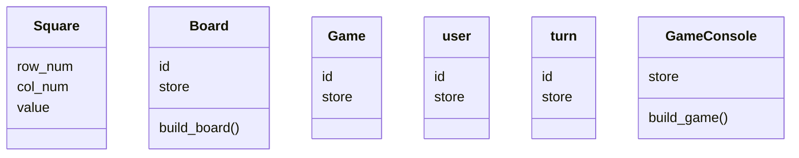

```mermaid
classDiagram

class Square{
    row_num
    col_num
    value
}


class Board{
    id
    store
    build_board()
}

class Game{
    id
    store
}

class user{
    id
    store
}

class turn{
    id
    store
}

class GameConsole{
    store
    build_game()
}


```